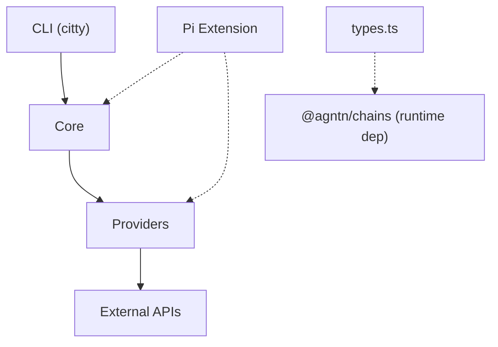

# explorers — AGENTS.md

## Scope

Unified block explorer provider library. Normalizes balances, tx history, contract info, token holdings, gas data, and block info across multiple chains and explorer APIs. Exports both CLI (`explorers` binary) and programmatic API.

## Providers

| Provider   | Auth                    | Chains                                                                           | Capabilities                                                |
| ---------- | ----------------------- | -------------------------------------------------------------------------------- | ----------------------------------------------------------- |
| etherscan  | API key (free: 5 req/s) | eth, base, arbitrum, optimism, polygon, bsc, avalanche, gnosis, linea, bera      | Full: balances, tx, transfers, contract, tokens, gas, block |
| blockscout | none                    | eth, base, arbitrum, optimism, polygon, gnosis, linea, scroll, zksync, avalanche | Full: balances, tx, transfers, contract, tokens, gas, block |
| blockchair | optional key            | bitcoin, eth                                                                     | balances, tx, block                                         |
| mempool    | none                    | bitcoin, litecoin                                                                | balances, tx, gas, block                                    |
| solscan    | `SOLSCAN_API_KEY`       | solana                                                                           | balances, tx detail/history, block                          |
| helius     | `HELIUS_API_KEY`        | solana                                                                           | tx detail/history; no balance endpoint                      |
| ton        | none                    | ton                                                                              | balances, tx                                                |
| tronscan   | `TRONSCAN_API_KEY`      | tron                                                                             | balances, tx detail/history, block                          |
| aptos      | none                    | aptos                                                                            | none; required methods throw                                |
| blockberry | `BLOCKBERRY_API_KEY`    | sui                                                                              | balances, tx history                                        |

## Conventions

- Chain names normalized via `normalizeChain()`, which takes display names as well as aliases like `ethereum`, `mainnet`, `arb`, `btc`
- Native and token amounts use strings in each chain's smallest unit — call `formatWei(value, decimals)` with the asset's decimals; its default is 18
- `noUncheckedIndexedAccess` and `noImplicitOverride` are enabled — guard indexed access and mark overrides explicitly
- Provider registration is a class side effect: each concrete class owns a static `key`, and importing `src/providers/index.js` triggers all `register()` calls
- Provider backends are explorer/indexer APIs only. Unsupported operations stay absent; required methods without an explorer contract throw `UnsupportedOperationError`.
- Bitcoin transactions from `mempool` carry their OP_RETURN pushes in `Transaction.opReturn`; each payload keeps its raw `hex` and gets a `text` reading only when the bytes are printable UTF-8
- CLI default subcommand: `balance` (for address-like input) or `providers` (no input)
- Error hierarchy: `ExplorerError` → `HTTPError`, `AuthError`, `RateLimitError`, `NotFoundError`, `UnsupportedChainError`, `UnsupportedOperationError`, `UnknownProviderError`
- HTTP client uses `ofetch` with a 15s default timeout and preserves out-of-range JSON integers as strings

## Key files

- `src/core/types.ts` - re-exports `ChainKey` from `@agntn/chains`; owns transaction, balance, token, contract, gas, block, and provider-config types
- `src/core/provider.ts` — abstract `Provider` base class and optional operation contract
- `src/core/errors.ts` — ExplorerError hierarchy + normalizeError
- `src/core/registry.ts` — Self-registering provider registry (register, create, providers, has)
- `src/core/resolve.ts` - Auto-select provider by env vars and the requested chain, default blockscout
- `src/core/client.ts` — HTTP client wrapper (ofetch)
- `src/core/ens.ts` — ENS resolution (public APIs, no keccak dependency)
- `src/core/input.ts` — User input classification (address/txhash/ens)
- `src/providers/*.ts` — One file per provider, self-registering via `register()`
- `src/commands/*.ts` - CLI subcommands (balance, tx, contract, tokens, transfers, gas, block, providers)
- `src/cli.ts` — Citty CLI entry point

## CLI subcommands

`balance`, `tx`, `contract`, `tokens`, `transfers`, `gas`, `block`, `providers` - all support `-c` (chain), `-p` (provider). `tx` accepts `-m history|detail` to resolve ambiguous hash/address formats. `transfers` accepts `-t` to limit results to one token contract. `tx`, `balance`, `tokens` and `transfers` support ENS.

## Constraints

- Etherscan: 5 req/s free tier, needs `ETHERSCAN_API_KEY`
- Blockchair: data format differs between BTC and EVM chains
- Solscan, Helius, TONAPI, TRONSCAN, Aptos, and Blockberry are single-chain providers and throw `UnsupportedChainError` for other chains.
- Helius Enhanced Transactions v0 exposes no REST balance endpoint, so `getBalance` throws `UnsupportedOperationError`; the key travels as the `api-key` query parameter, which `sanitizeUrl` redacts.
- Aptos Explorer has no documented account/history API; `aptos` remains registered with false capabilities and throws `UnsupportedOperationError` instead of using fullnode REST.
- TONAPI and Blockberry do not expose block lookup compatible with the library's single block-number contract, so `blockInfo` is unsupported.
- Mempool: Bitcoin only

## Architecture

Three-layer design: **CLI** → **Core** → **Providers**.



### Layer breakdown

- **CLI Layer** (`cli.ts`, `commands/*.ts`): citty-based CLI, lazy-loads subcommands via dynamic `import()`. `cli-args.ts` normalizes bare address input to `balance` subcommand.
- **Core Layer** (`core/*.ts`): Domain types, provider registry (side-effect registration), HTTP client (ofetch, 15s timeout), ENS resolution (public APIs), input classification, error hierarchy.
- **Provider Layer** (`providers/*.ts`): 10 self-registering providers. Each file defines API types, helper mappers, a concrete `Provider` subclass with a static registry key, and calls `register()` with its constructor at module scope.
- **Pi Extension** (`packages/pi/extensions/explorers.ts`): Exposes 9 tools to Pi coding agent, matching the MCP server's tool set. Lazy-loads `@agntn/explorers` via dynamic import with fallback to source. `packages/omp/extensions/explorers.ts` registers the same nine for OMP.

### Provider categories

1. **Multi-chain EVM** (etherscan, blockscout): support 10 EVM chains each
2. **Bitcoin/Ethereum bridge** (blockchair): dashboard API for Bitcoin and Ethereum
3. **Bitcoin/Litecoin** (mempool): UTXO model; Litecoin rides the litecoinspace.org fork of the same API
4. **Single-chain non-EVM** (solscan, helius, ton, tronscan, aptos, blockberry): capabilities mirror only their explorer APIs; Aptos is explicitly unsupported

## Patterns

- **Side-effect registration**: `import './providers/index.js'` triggers all `register()` calls. Each class owns its registry key as `static key`.
- **String-only values**: All wei/satoshi/native amounts are strings (`Balance.balance`, `TokenBalance.balance`). The HTTP boundary preserves unsafe JSON integers as strings; `formatWei()` converts amounts for display.
- **Optional methods**: `getTxDetail`, `getContractInfo`, `getTokenBalances`, `getTokenTransfers`, `getGasData`, and `getBlockInfo` are optional on `Provider`. Always check both the `capabilities` getter and method presence before calling.
- **Dynamic CLI imports**: Each subcommand is lazily loaded via `() => import('./commands/X.js').then(m => m.default)`.
- **Chain normalization**: `normalizeChain()` delegates to `getChain()` from `@agntn/chains` and returns the canonical `ChainKey`. Aliases and display names both resolve (`ethereum→eth`, `btc→bitcoin`, `arb→arbitrum`). Missing input defaults to `eth`; unknown names and the empty string throw.
- **Provider auto-selection**: `resolveProvider()` checks env vars for each provider, falls back to `blockscout` (no key needed).
- **Error sanitization**: `HTTPError` strips API keys from URLs in error messages. `normalizeError()` wraps unknown errors into typed `ExplorerError` subclasses.

## Anti-patterns to avoid

- Importing individual provider files without the barrel — breaks registration chain
- Calling an optional provider method without checking `capabilities` and method presence — unsupported operations stay absent at runtime
- Assuming EVM address formats work on non-EVM chains (Solana base58, TON base64, TRON base58/hex)
- Hardcoding chain names — always use `normalizeChain()` for user input

## Test coverage gaps

**Covered** (19 test files): provider base/registry, provider resolution, HTTP client, path safety, amount formatting, errors, input classification, chain normalization, CLI argument routing, plus all ten providers.
**Missing**: CLI command execution and the Pi extension.
**Test style**: Focused unit tests for local contracts and mocked explorer-API responses; public no-key providers may additionally use live roundtrips.

## Dependencies

- `@agntn/chains`: canonical chain registry. `ChainKey` for keys, `getChain()` for alias resolution, `create(key)` for per-chain metadata like symbol and chain ID. Stays external to the bundle, so a consumer and this library share one registry instead of two.
- `citty`: CLI framework
- `consola`: Logging
- `ofetch`: HTTP client
- `obuild`: Build tool (bundle mode)
- `vitest`: Testing

## Build & Scripts

```bash
pnpm build          # obuild → dist/
pnpm dev            # obuild --stub (watch mode)
pnpm typecheck      # tsc --noEmit
pnpm test           # vitest watch
pnpm test:run       # vitest single run
```
