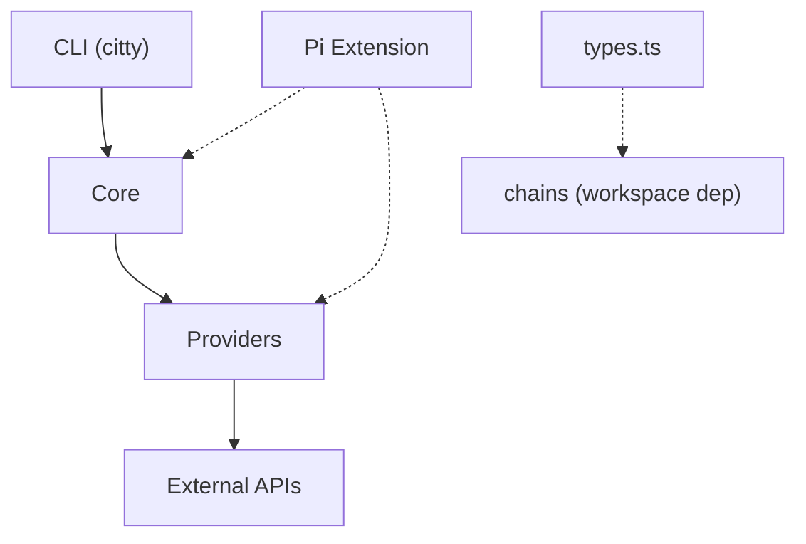

# blocex — AGENTS.md

## Scope

Unified block explorer provider library. Normalizes balances, tx history, contract info, token holdings, gas data, and block info across multiple chains and explorer APIs. Exports both CLI (`blocex` binary) and programmatic API.

## Providers

| Provider | Auth | Chains | Capabilities |
|---|---|---|---|
| etherscan | API key (free: 5 req/s) | eth, base, arbitrum, optimism, polygon, bsc, avalanche, fantom, gnosis, linea, zksync, scroll | Full: balances, tx, contract, tokens, gas, block |
| blockscout | none | eth, base, arbitrum, optimism, polygon, gnosis, linea, scroll, zksync, avalanche | Full: balances, tx, contract, tokens, gas, block |
| blockchair | optional key | bitcoin, eth, base, arbitrum, optimism, polygon, bsc, avalanche, gnosis | balances, tx, contract, block |
| mempool | none | bitcoin | balances, tx, gas, block |
| solana | none | solana | balances, tx, gas, block |
| ton | none | ton | balances, tx, block |
| tron | none | tron | balances, tx, block |
| aptos | none | aptos | balances, tx, block |
| sui | none | sui | balances, tx, gas, block |

## Conventions

- Chain names normalized via `normalizeChain()` — accepts aliases like `ethereum`, `mainnet`, `arb`, `btc`
- All values in wei as strings (never float) — `formatWei()` for display
- `noUncheckedIndexedAccess: true` — Record access gives `| undefined`, use `?? ''` for required fields
- Provider registration is side-effect: importing `src/providers/index.js` triggers all `register()` calls
- CLI default subcommand: `balance` (for address-like input) or `providers` (no input)
- Error hierarchy: `BlocexError` → `HTTPError`, `AuthError`, `RateLimitError`, `NotFoundError`, `UnsupportedChainError`, `UnknownProviderError`
- HTTP client uses `ofetch` with 15s default timeout

## Key files

- `src/core/types.ts` — Chain, Transaction, Balance, TokenBalance, ContractInfo, GasData, BlockInfo, BlocexProvider interface
- `src/core/errors.ts` — BlocexError hierarchy + normalizeError
- `src/core/registry.ts` — Self-registering provider registry (register, create, providers, has)
- `src/core/resolve.ts` — Auto-select provider by env vars, default blockscout
- `src/core/client.ts` — HTTP client wrapper (ofetch)
- `src/core/ens.ts` — ENS resolution (public APIs, no keccak dependency)
- `src/core/input.ts` — User input classification (address/txhash/ens)
- `src/providers/*.ts` — One file per provider, self-registering via `register()`
- `src/commands/*.ts` — CLI subcommands (balance, tx, contract, tokens, gas, block, providers)
- `src/cli.ts` — Citty CLI entry point

## CLI subcommands

`balance`, `tx`, `contract`, `tokens`, `gas`, `block`, `providers` — all support `-c` (chain), `-p` (provider). `tx` and `balance` support ENS.

## Constraints

- Etherscan: 5 req/s free tier, needs `ETHERSCAN_API_KEY`
- Blockchair: data format differs between BTC and EVM chains
- Solana/TON/TRON/Aptos/Sui: single-chain providers, throw `UnsupportedChainError` for other chains
- Mempool: Bitcoin only
- No LICENSE file yet

## Architecture

Three-layer design: **CLI** → **Core** → **Providers**.



### Layer breakdown

- **CLI Layer** (`cli.ts`, `commands/*.ts`): citty-based CLI, lazy-loads subcommands via dynamic `import()`. `cli-args.ts` normalizes bare address input to `balance` subcommand.
- **Core Layer** (`core/*.ts`): Domain types, provider registry (side-effect registration), HTTP client (ofetch, 15s timeout), ENS resolution (public APIs), input classification, error hierarchy.
- **Provider Layer** (`providers/*.ts`): 9 self-registering providers. Each file defines API types, helper mappers, a class implementing `BlocexProvider`, and calls `register()` at module scope.
- **Pi Extension** (`packages/pi/extensions/blocex.ts`): Exposes 6 tools to Pi coding agent. Lazy-loads blocex via dynamic import with fallback to source.

### Provider categories

1. **Multi-chain EVM** (etherscan, blockscout, blockchair): support 9-12 EVM chains each
2. **Bitcoin** (mempool, blockchair): UTXO model, different data shape
3. **Single-chain non-EVM** (solana, ton, tron, aptos, sui): each implements full `BlocexProvider` for one chain only

## Patterns

- **Side-effect registration**: `import './providers/index.js'` triggers all `register()` calls. Never import individual providers without going through the barrel.
- **String-only values**: All wei/satoshi/native amounts are strings (`Balance.balance`, `TokenBalance.balance`). `formatWei()` converts to human-readable. No floats in domain types.
- **Optional methods**: `getTokenBalances`, `getGasData`, `getBlockInfo` are optional on `BlocexProvider`. Always check `capabilities()` before calling.
- **Dynamic CLI imports**: Each subcommand is lazily loaded via `() => import('./commands/X.js').then(m => m.default)`.
- **Chain normalization**: `normalizeChain()` accepts canonical keys (from `CHAIN_DATA`) and aliases (`ethereum→eth`, `btc→bitcoin`, `arb→arbitrum`). Falls back to `eth`.
- **Provider auto-selection**: `resolveProvider()` checks env vars for each provider, falls back to `blockscout` (no key needed).
- **Error sanitization**: `HTTPError` strips API keys from URLs in error messages. `normalizeError()` wraps unknown errors into typed `BlocexError` subclasses.

## Anti-patterns to avoid

- Importing individual provider files without the barrel — breaks registration chain
- Using `getTokenBalances`/`getGasData`/`getBlockInfo` without checking `capabilities()` first — will throw TypeError on providers that don't implement them
- Assuming EVM address formats work on non-EVM chains (Solana base58, TON base64, TRON base58/hex)
- Hardcoding chain names — always use `normalizeChain()` for user input

## Test coverage gaps

**Covered** (8 test files): blockscout, ens, solana, mempool, sui, aptos, tron, ton
**Missing**: etherscan, blockchair, core/types utilities, core/registry, core/resolve, core/client, core/input, CLI commands
**Test style**: Live roundtrips against public APIs (no mocks). Tests verify structure + sanity (balance > 0, tx count > 0).

## Dependencies

- `chains` (workspace dep via `file:../chains`): provides `CHAIN_DATA` for chain metadata
- `citty`: CLI framework
- `consola`: Logging
- `ofetch`: HTTP client
- `obuild`: Build tool (bundle mode)
- `vitest`: Testing

## Build & Scripts

```bash
pnpm build          # obuild → dist/
pnpm dev            # obuild --stub (watch mode)
pnpm typecheck      # tsc --noEmit
pnpm test           # vitest watch
pnpm test:run       # vitest single run
```

## Onboard Progress

- [x] Phase 1: DISCOVER — structure mapped, root AGENTS.md
- [x] Phase 2: ABSORB — all source read, patterns extracted
- [x] Phase 3: WIKI — 3 concept pages, 1 entity page (updated from 3→9 providers)
- [x] Phase 4: MEMORY — 10 facts retained
- [x] Phase 5: EVOLVE — updated AGENTS.md, created src/AGENTS.md, updated wiki entity

<!-- gitnexus:start -->
# GitNexus — Code Intelligence

This project is indexed by GitNexus as **blocex** (479 symbols, 1343 relationships, 40 execution flows). Use the GitNexus MCP tools to understand code, assess impact, and navigate safely.

> Index stale? Run `node .gitnexus/run.cjs analyze` from the project root — it auto-selects an available runner. No `.gitnexus/run.cjs` yet? `npx gitnexus analyze` (npm 11 crash → `npm i -g gitnexus`; #1939).

## Always Do

- **MUST run impact analysis before editing any symbol.** Before modifying a function, class, or method, run `impact({target: "symbolName", direction: "upstream"})` and report the blast radius (direct callers, affected processes, risk level) to the user.
- **MUST run `detect_changes()` before committing** to verify your changes only affect expected symbols and execution flows. For regression review, compare against the default branch: `detect_changes({scope: "compare", base_ref: "main"})`.
- **MUST warn the user** if impact analysis returns HIGH or CRITICAL risk before proceeding with edits.
- When exploring unfamiliar code, use `query({query: "concept"})` to find execution flows instead of grepping. It returns process-grouped results ranked by relevance.
- When you need full context on a specific symbol — callers, callees, which execution flows it participates in — use `context({name: "symbolName"})`.

## Never Do

- NEVER edit a function, class, or method without first running `impact` on it.
- NEVER ignore HIGH or CRITICAL risk warnings from impact analysis.
- NEVER rename symbols with find-and-replace — use `rename` which understands the call graph.
- NEVER commit changes without running `detect_changes()` to check affected scope.

## Resources

| Resource | Use for |
|----------|---------|
| `gitnexus://repo/blocex/context` | Codebase overview, check index freshness |
| `gitnexus://repo/blocex/clusters` | All functional areas |
| `gitnexus://repo/blocex/processes` | All execution flows |
| `gitnexus://repo/blocex/process/{name}` | Step-by-step execution trace |

## CLI

| Task | Read this skill file |
|------|---------------------|
| Understand architecture / "How does X work?" | `.claude/skills/gitnexus/gitnexus-exploring/SKILL.md` |
| Blast radius / "What breaks if I change X?" | `.claude/skills/gitnexus/gitnexus-impact-analysis/SKILL.md` |
| Trace bugs / "Why is X failing?" | `.claude/skills/gitnexus/gitnexus-debugging/SKILL.md` |
| Rename / extract / split / refactor | `.claude/skills/gitnexus/gitnexus-refactoring/SKILL.md` |
| Tools, resources, schema reference | `.claude/skills/gitnexus/gitnexus-guide/SKILL.md` |
| Index, status, clean, wiki CLI commands | `.claude/skills/gitnexus/gitnexus-cli/SKILL.md` |

<!-- gitnexus:end -->
