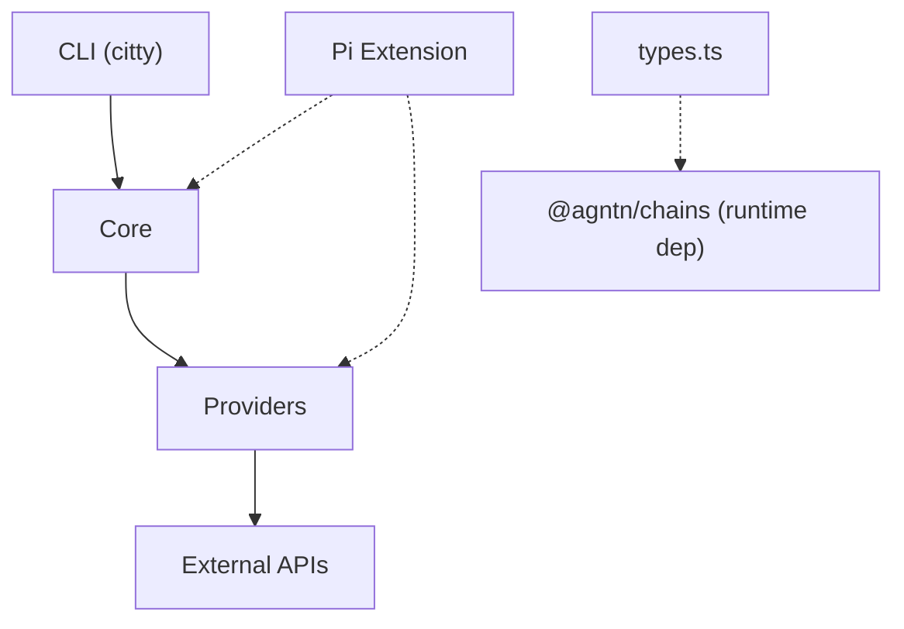

# explorers — AGENTS.md

## Scope

Unified block explorer provider library. Normalizes balances, tx history, contract info, token holdings, gas data, and block info across multiple chains and explorer APIs. Exports both CLI (`explorers` binary) and programmatic API.

## Providers

| Provider    | Auth                    | Chains                                                                           | Capabilities                                                |
| ----------- | ----------------------- | -------------------------------------------------------------------------------- | ----------------------------------------------------------- |
| etherscan   | API key (free: 5 req/s) | eth, base, arbitrum, optimism, polygon, bsc, avalanche, gnosis, linea, bera      | Full: balances, tx, transfers, contract, tokens, gas, block |
| blockscout  | none                    | eth, base, arbitrum, optimism, polygon, gnosis, linea, scroll, zksync, avalanche | Full: balances, tx, transfers, contract, tokens, gas, block |
| blockchair  | optional key            | bitcoin, eth, ecash                                                              | balances, tx, block                                         |
| mempool     | none                    | bitcoin, litecoin, pepecoin                                                      | balances, tx, utxos; gas and block on Bitcoin and Litecoin  |
| blockstream | none                    | bitcoin                                                                          | balances, tx detail/history, utxos, block                   |
| solscan     | `SOLSCAN_API_KEY`       | solana                                                                           | balances, tx detail/history, block                          |
| helius      | `HELIUS_API_KEY`        | solana                                                                           | tx detail/history, tokens; no balance endpoint              |
| ton         | none                    | ton                                                                              | balances, tx                                                |
| tronscan    | `TRONSCAN_API_KEY`      | tron                                                                             | balances, tx detail/history, block                          |
| aptos       | none                    | aptos                                                                            | none; required methods throw                                |
| blockberry  | `BLOCKBERRY_API_KEY`    | sui                                                                              | balances, tx history                                        |
| koios       | none                    | cardano                                                                          | balances, tx detail/history, tokens                         |
| arweave     | none                    | arweave                                                                          | balances, tx detail/history, block                          |
| dcrdata     | none                    | decred                                                                           | balances, tx detail/history, block                          |
| horizon     | none                    | stellar                                                                          | balances, tx detail/history, transfers, tokens, gas, block  |

## Conventions

- Chain names normalized via `normalizeChain()`, which takes display names as well as aliases like `ethereum`, `mainnet`, `arb`, `btc`
- Native and token amounts use strings in each chain's smallest unit — call `formatWei(value, decimals)` with the asset's decimals; its default is 18
- `noUncheckedIndexedAccess` and `noImplicitOverride` are enabled — guard indexed access and mark overrides explicitly
- Provider registration runs off a manifest: `src/providers/index.ts` lists every built-in as `{ key, chains, capabilities, defaultURL?, load }`, and `core/registry.ts` turns that list into its map on the first registry call. The class itself only owns `static readonly key`
- Provider backends are explorer/indexer APIs, including documented gateway APIs. Judge support by the service and response contract, not REST versus GraphQL: a gateway may expose REST routes shared with nodes. Do not silently switch to another node to fill a missing capability. Unsupported operations stay absent; required methods without a supported service contract throw `UnsupportedOperationError`.
- `Transaction.to` is `null` whenever the explorer names no recipient, not only on a contract creation: Solscan, Helius and Blockberry never name one, and an Arweave data upload keeps the documented `""`. Etherscan and Blockscout put the deployed address in `createdContract`, and the CLI, Pi and OMP renderers print a recipient or a created contract only when the record has one, a `?` in place of a missing recipient in a history line
- Bitcoin, Litecoin and Pepecoin transactions from `mempool` carry their OP_RETURN pushes in `Transaction.opReturn`; each payload keeps its raw `hex` and gets a `text` reading only when the bytes are printable UTF-8
- `mempool` and `blockstream` list unspent outputs through Esplora `/api/address/:address/utxo`. A `Utxo` row keeps `txid`, `vout`, `value` as a base-unit string and the funding block, `null` while the output waits in the mempool. Providers without such an endpoint keep `utxos: false` and no `getUtxos` method
- CLI default subcommand: `balance` (for address-like input) or `providers` (no input)
- Error hierarchy: `ExplorerError` → `HTTPError`, `TransportError`, `AuthError`, `RateLimitError`, `PlanRestrictedError`, `NotFoundError`, `UnsupportedChainError`, `UnsupportedOperationError`, `UnknownProviderError`, `AddressChainMismatchError`
- HTTP client uses `ofetch` with a 15s default timeout and preserves out-of-range JSON integers as strings

## Key files

- `src/core/types.ts` - re-exports `ChainKey` from `@agntn/chains`; owns transaction, balance, token, contract, gas, block, and provider-config types
- `src/core/provider.ts` - abstract `Provider` base class and optional operation contract. `getJSON`/`postJSON` retry HTTP 429 and JSON that mentions a rate limit on the same backend with backoff
- `src/core/errors.ts` - ExplorerError hierarchy + normalizeError. HTTP 429 copies `Retry-After` onto `RateLimitError.retryAfter`. A request with no response becomes `TransportError` with the reason and code of its innermost cause, never an `HTTPError` with status 0
- `src/core/registry.ts` - Provider registry built from `builtins` on first use; `create()` is async and imports one provider (register, create, providers, listProviders, has). `listProviders()` describes every provider from metadata and backs the `providers` command and `explorers_providers` on MCP, Pi and OMP
- `src/core/resolve.ts` - Auto-select built-in providers by env vars and chain, with one fallback after no answer, a 5xx, or a rate or plan limit that survived retries on that backend
- `src/core/client.ts` — HTTP client wrapper (ofetch)
- `src/core/ens.ts` — ENS resolution (public APIs, no keccak dependency)
- `src/core/input.ts` — User input classification (address/txhash/ens)
- `src/providers/*.ts` — One file per provider, each exporting its class, listed in `builtins` and built as its own bundle entry
- `src/commands/*.ts` - CLI subcommands (balance, tx, utxos, contract, tokens, transfers, gas, block, providers)
- `src/cli.ts` — Citty CLI entry point

## CLI subcommands

`balance`, `tx`, `utxos`, `contract`, `tokens`, `transfers`, `gas`, `block`, `providers` - all support `-c` (chain), `-p` (provider). `tx` accepts `-m history|detail` to resolve ambiguous hash/address formats. `transfers` accepts `-t` to limit results to one token contract. `tokens` lists fifty holdings unless `-n` says otherwise, a hundred at most, and its first line counts every one. `tx`, `balance`, `tokens` and `transfers` support ENS.

## Constraints

- Etherscan: 5 req/s free tier, needs `ETHERSCAN_API_KEY`
- Blockscout serves the complete holding array from `/addresses/:address/token-balances`; large wallets can produce multi-megabyte responses, so this read allows 60 seconds unless `ProviderConfig.timeout` overrides it.
- Blockchair: data format differs between UTXO (bitcoin, ecash) and EVM chains; eCash amounts are satoshis at 2 decimals (100 satoshis = 1 XEC)
- Blockchair answers a spent limit with 402 or 435 to 437 and a blocked IP with 430 or 434. `read()` in the provider turns those into `RateLimitError` with `context.error` in the message, outside `Provider` retries, since a block does not clear in seconds; a keyless block also names `BLOCKCHAIR_API_KEY`
- Solscan, Helius, TONAPI, TRONSCAN, Aptos, Blockberry and Horizon are single-chain providers and throw `UnsupportedChainError` for other chains.
- Helius Enhanced Transactions v0 exposes no REST balance endpoint, so `getBalance` throws `UnsupportedOperationError`; the key travels as the `api-key` query parameter, which `sanitizeUrl` redacts.
- Helius `getTokenBalances` calls DAS `searchAssets` on the RPC root, so it answers over JSON-RPC and a failure arrives as `error` inside a 200 response. Pages hold 1000 assets and the walk stops after 20 of them.
- Arweave uses gateway REST for `/wallet/{address}/balance` and `/block/height/{height}`, and GraphQL for transactions. It merges owner and recipient queries, removes self-transfer duplicates, and caps the history window at `page * limit <= 1000` with `limit` from 1 to 100. `baseUrl` is the gateway root for both APIs. Balance snapshot height/hash stay null because the endpoint does not return them. Block gas fields use `"0"` as the existing non-EVM convention; storage price quotes are not gas data. Contracts and token operations stay unsupported. Amounts use winstons (12 decimals), missing recipients stay empty strings, and bundle fees are not attributed to individual data items. Arweave transaction IDs and addresses share their shape, so CLI detail reads require `-m detail`.
- Aptos Explorer has no documented account/history API; `aptos` remains registered with false capabilities and throws `UnsupportedOperationError` instead of using fullnode REST.
- TONAPI and Blockberry do not expose block lookup compatible with the library's single block-number contract, so `blockInfo` is unsupported.
- Mempool: Bitcoin, Litecoin and Pepecoin; Litecoin uses litecoinspace.org, while peppool.space serves balances and transactions but lacks fee recommendations and complete normalized block metadata. Peppool paginates confirmed address history with `?after_txid=`, not Esplora's `/txs/chain/:txid` route
- Blockstream serves Bitcoin through the Esplora wire format; its `/api/fee-estimates` response does not match Mempool's recommendation shape, so gas data stays unsupported
- Koios answers on POST with the address or hash in the request body, and the public instance rejects a body over 5120 bytes, so `getTxHistory` asks `tx_info` for 70 hashes at a time and reorders the answer, which comes back in the endpoint's own order
- Koios `address_info` ships the whole UTxO set of an address, 222 kB for a busy one, so `getBalance` narrows the payload with the PostgREST `select` parameter; the endpoint still builds that set before it answers, and a busy address takes 3 to 9 seconds against the 15-second client timeout
- Koios keeps the phase-2 validity flag behind the heavier `_scripts` payload, so a Cardano transaction reads as `success` even when a failing script consumed its collateral; `isContractInteraction` comes from the presence of collateral inputs
- dcrdata uses Insight for Decred balances, transaction history/details and blocks. `baseUrl` is the Insight API root. Amounts use atoms (8 decimals). Balance and funded/spent totals stay confirmed, the signed mempool delta goes to `unconfirmed`, and snapshot fields stay null. The balance is not a spendability check. Chain/address format checks use `@agntn/chains`; checksum validation belongs to the service. History uses `from`/`to` pagination, supports limits 1 to 250 and both sort directions, and rejects unsupported block bounds. Transaction values pair with one addressed output, with full inputs/outputs in `raw`; positive confirmations do not independently prove stake-vote approval. Block responses are arrays and count regular plus stake transactions; miner stays empty and gas fields use "0". Insight's estimatefee is only a relay fee, so gas data remains unsupported.
- Horizon serves Stellar from the SDF's public instance at horizon.stellar.org, keyless, with one year of history; `baseUrl` is any other Horizon root. Amounts are stroops (7 decimals) and Horizon prints them as decimals, so `toStroops` converts without floats. `getBalance` reads `/accounts/{id}` and keeps snapshot fields null; an account the ledger never funded is a 404, so `NotFoundError`. Issued assets are `CODE:ISSUER` (SEP-11) with 7 decimals; trustlines back `getTokenBalances`, liquidity pool shares stay out. History is `/accounts/{id}/payments?join=transactions`, one row per payment-like operation (payment, path payments, create_account, account_merge, invoke_host_function with its balance changes), failed ones included with `status: "failed"` and no token transfers; rows of one transaction share its hash and only a single-operation transaction carries `fee`. `limit` up to 200, `page` up to 10 by walking cursors, no ledger bounds. `getTokenTransfers` scans up to five pages of 200 payments client-side, `token` filters one `CODE:ISSUER`. `getTxDetail` joins `/transactions/{hash}` with its operations: the first payment-like one is the row, every issued-asset movement lands in `tokenTransfers`, Soroban operations set `isContractInteraction`. Gas is `/fee_stats` in stroops per operation: `baseFee` is the ledger base fee, `safeGasPrice` the mode of `fee_charged` (100 outside surge pricing, the marginal inclusion fee inside it), `fastGasPrice` its p95, which Soroban resource fees dominate; no `proposedGasPrice`, because every percentile between mixes classic and Soroban operations. A ledger is a block with `txCount` counting successful and failed transactions, `baseFee` its base fee, miner empty and gas fields `"0"`. Contracts stay unsupported: Soroban state lives behind RPC, not Horizon. Muxed (`M...`) addresses are rejected by `@agntn/chains`

## Architecture

Three-layer design: **CLI** → **Core** → **Providers**.



### Layer breakdown

- **CLI Layer** (`cli.ts`, `commands/*.ts`): citty-based CLI, lazy-loads subcommands via dynamic `import()`. `cli-args.ts` normalizes bare address input to `balance` subcommand.
- **Core Layer** (`core/*.ts`): Domain types, provider registry (built lazily from the barrel list), HTTP client (ofetch, 15s timeout), ENS resolution (public APIs), input classification, error hierarchy.
- **Provider Layer** (`providers/*.ts`): 15 providers. Each file defines API types, helper mappers and a concrete `Provider` subclass with a static registry key, exports that class, and ships as its own bundle so `create()` can import it alone.
- **Pi Extension** (`packages/pi/extensions/explorers.ts`): Exposes 10 tools to Pi coding agent, matching the MCP server's tool set. Lazy-loads live `src/` from a checkout and the relative `dist/` module from an installed package, without self-importing the package by name. `packages/omp/extensions/explorers.ts` registers the same ten for OMP.

### Provider categories

1. **Multi-chain EVM** (etherscan, blockscout): support 10 EVM chains each
2. **Bitcoin/Ethereum bridge** (blockchair): dashboard API for Bitcoin, Ethereum and eCash
3. **Esplora-compatible UTXO** (mempool, blockstream): Mempool serves Bitcoin, Litecoin and Pepecoin; Blockstream serves Bitcoin as an independent backend
4. **Single-chain non-EVM** (solscan, helius, ton, tronscan, aptos, blockberry, koios, arweave, dcrdata, horizon): capabilities mirror only their explorer APIs; Aptos is explicitly unsupported

## Patterns

- **Lazy registration**: `providers/index.ts` exports `builtins` with metadata and a `load` per provider, and `core/registry.ts` builds its map the first time anything asks the registry. `create(name)` awaits `load()` once and caches the class; every metadata question stays synchronous. `register(providerClass, meta)` covers provider classes living outside the package.
- **Nothing runs on import**: library modules evaluate to declarations only. Derived values wait for their first use, such as `entries()` in the registry, `decoder()` in mempool and `agent()` in the HTTP client. `dist/cli.mjs` is the one bundle that runs on load, because it starts the CLI, and `sideEffects` in `package.json` says so.
- **Measuring that claim**: `pnpm build` prints `Side effects` per bundle, but with `sideEffects` declared the number is circular, since the bundler believes the field. For a real reading, drop the field, rebuild, and compare: everything except `dist/cli.mjs` then comes back under 1 kB, and `INSPECT_BUILD=1 pnpm build` shows the remainder is the bundler runtime plus bare `ofetch` and `@agntn/chains` imports, not our code.
- **String-only values**: All wei/satoshi/native amounts are strings (`Balance.balance`, `TokenBalance.balance`). The HTTP boundary preserves unsafe JSON integers as strings; `formatWei()` converts amounts for display.
- **Optional methods**: `getTxDetail`, `getUtxos`, `getContractInfo`, `getTokenBalances`, `getTokenTransfers`, `getGasData`, and `getBlockInfo` are optional on `Provider`. Always check both the `capabilities` getter and method presence before calling.
- **Dynamic CLI imports**: Each subcommand is lazily loaded via `() => import('./commands/X.js').then(m => m.default)`. Citty loads command declarations for help, so runtime core imports belong inside `run()` or execution helpers.
- **Chain normalization**: `normalizeChain()` delegates to `getChain()` from `@agntn/chains` and returns the canonical `ChainKey`. Aliases and display names both resolve (`ethereum→eth`, `btc→bitcoin`, `arb→arbitrum`). Missing input defaults to `eth`; unknown names and the empty string throw.
- **Chain from the address**: without an explicit chain, `withProvider()` takes the chain `inferChain()` reads off the address when `identify()` from `@agntn/chains` finds exactly one; EVM addresses, ENS names and unknown formats keep the defaults. `resolveInput()` throws `AddressChainMismatchError` before any request only when the requested chain rejects the address and every chain that accepts it belongs to another family: shared formats such as Bitcoin P2SH on Litecoin and forms the validators miss, such as raw TON or hex TRON, still reach the provider
- **Provider auto-selection**: `resolveProvider()` checks env vars, chain support, and an optional requested capability without loading provider modules. `withProvider()` keeps explicit choices strict and retries automatic reads once on another available built-in after `RateLimitError`, `PlanRestrictedError`, a `TransportError` that is not the caller's abort, or a 5xx `HTTPError`; when that retry fails too, its error keeps the first one as `cause`. A `PlanRestrictedError` on an automatic read with a capability puts that provider last for the same chain and capability for an hour, keyed to its credentials, and out of the fallback slot; it still answers when nobody else serves the read. Keyless Blockchair ranks behind every provider that needs no key, so Bitcoin retries on Blockstream. 429 waits on that backend happen in `Provider` first. The callback must be safe to run twice.
- **Error sanitization**: `HTTPError` strips API keys from URLs in error messages. `normalizeError()` wraps unknown errors into typed `ExplorerError` subclasses.
- **Terminal boundary**: CLI result lines go through `print()` in `commands/shared.ts`, which drops control bytes and line breaks before a token symbol, contract name or decoded method reaches the terminal, so a field cannot pose as the next result line. The OMP and Pi extensions apply the same filter per line in `sanitizeTerminalText()`, and every renderer splits an OP_RETURN message itself and indents its continuation lines. MCP output is JSON, where those bytes arrive escaped.
- **MCP payload boundary**: `src/mcp.ts` answers with the normalized shape and withholds the heavy optional fields until a call asks: `Transaction.raw` behind `raw: true` on `explorers_tx_history` and `explorers_tx_detail`, `ContractInfo.abi` and `sourceCode` behind `abi` and `sourceCode` on `explorers_contract`. `explorers_tokens` defaults `nonZeroOnly` to true, matching the CLI, Pi and OMP, and lists fifty holdings unless `limit` (up to 100) says otherwise, with `total` counting every holding; the CLI, Pi and OMP cut at the same fifty and print the count in their first line, since a wallet that has been airdropped at holds thousands. `getTokenBalances()` itself still returns every holding. The library types keep every field; the CLI, Pi and OMP renderers never printed them.

## Anti-patterns to avoid

- Writing a provider file without adding its chains and capabilities to `builtins` — the class never reaches capability-aware routing, and `test/unit/registry.test.ts` fails
- A top-level call in a module the library entry can reach (`new Set()`, `Object.keys()`, a decoder, a prebuilt map) — it pins that module into every consumer bundle, which `pnpm build` reports as growing `Side effects`
- Calling an optional provider method without checking `capabilities` and method presence — unsupported operations stay absent at runtime
- Assuming EVM address formats work on non-EVM chains (Solana base58, TON base64, TRON base58/hex)
- Hardcoding chain names — always use `normalizeChain()` for user input

## Test coverage gaps

**Covered** (36 test files): provider base/registry, provider resolution, HTTP client, path safety, amount formatting, errors, input classification, chain normalization, CLI argument routing, extension integration, plus all fifteen providers.
**CLI coverage**: help without backend imports, errors for unknown chains, provider listing, and mocked balance, transaction and token reads. Successful contract, transfer, gas, and block command execution remains untested.
**Test style**: Focused unit tests for local contracts and mocked explorer API responses. Live roundtrips belong in `test/live` and run only through `pnpm test:live`.

## Dependencies

- `@agntn/chains`: canonical chain registry. `ChainKey` for keys, `getChain()` for alias resolution, `create(key)` for per-chain metadata like symbol and chain ID. Stays external to the bundle, so a consumer and this library share one registry instead of two.
- `citty`: CLI framework
- `consola`: Logging
- `ofetch`: HTTP client
- `obuild`: Build tool (bundle mode)
- `vitest`: Testing

## Build & Scripts

```bash
pnpm build          # obuild → dist/
pnpm dev            # obuild --stub (watch mode)
pnpm typecheck      # build, then tsc --noEmit
pnpm lint           # oxlint, then oxfmt --check; CHANGELOG.md stays out of oxfmt
pnpm test           # vitest watch (unit, offline)
pnpm test:run       # vitest single run (unit, offline)
pnpm test:live      # public explorer roundtrips, not CI
pnpm release        # test, changelog, tag, push; CI publishes the tag
```

Every pull request and push to `main` runs lint, typecheck, build and `pnpm test:run` on Node 24 and 26 through `.github/workflows/test.yml`; `autofix.yml` commits what `pnpm fmt` changes back to the pull request branch.
